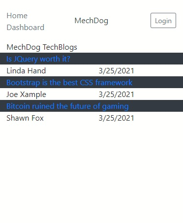
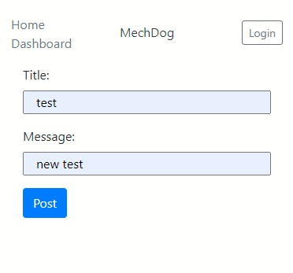
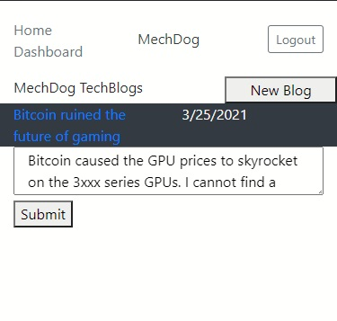

# MechDog_TechBlog
Tech blog site, complete with login/logout function, posts, comments. Using: Handlebars.js, Sequelize, and Express-session

  
---
## Author
  
Shawn Fox
  
  
| [GitHub](https://github.com/sfoxgit) | [Email](sfoxgit@gmail.com) |
  
---
## Project Links:
  
- Deployed site: [Heroku](https://blooming-island-18457.herokuapp.com/)
  
- GitHub: [sfoxgit](https://github.com/sfoxgit/README_Generator)
  
---
## Table of Contents
  
- [Description](##Description)
  
- [Installation](##Installation)
  
- [Usage](##Usage)
  
- [Questions](##Questions)
  
- [License](##License)
  
- [Contributions](##Contributing)
  
- [Credits](##Credits)
  
---
## Description
  
Tech blog site, complete with login/logout function, posts, comments. Using: Handlebars.js, Sequelize, and Express-session

---
## Installation

Hosted to heroku
  
---
## Usage
  
Home Screen

Making a new blog

Current user's blogs

  
---
## Questions
  
If you have any questions or concerns please contact me at sfoxgit@gmail.com or any of my contact information above. [Back to Author](##Author) 
  
--- 
 
## License 
 
https://opensource.org/licenses/MIT
  
---
## Contributing
  
If you'd like to contribute, please contact me.
  
---
## Credits
  

  

